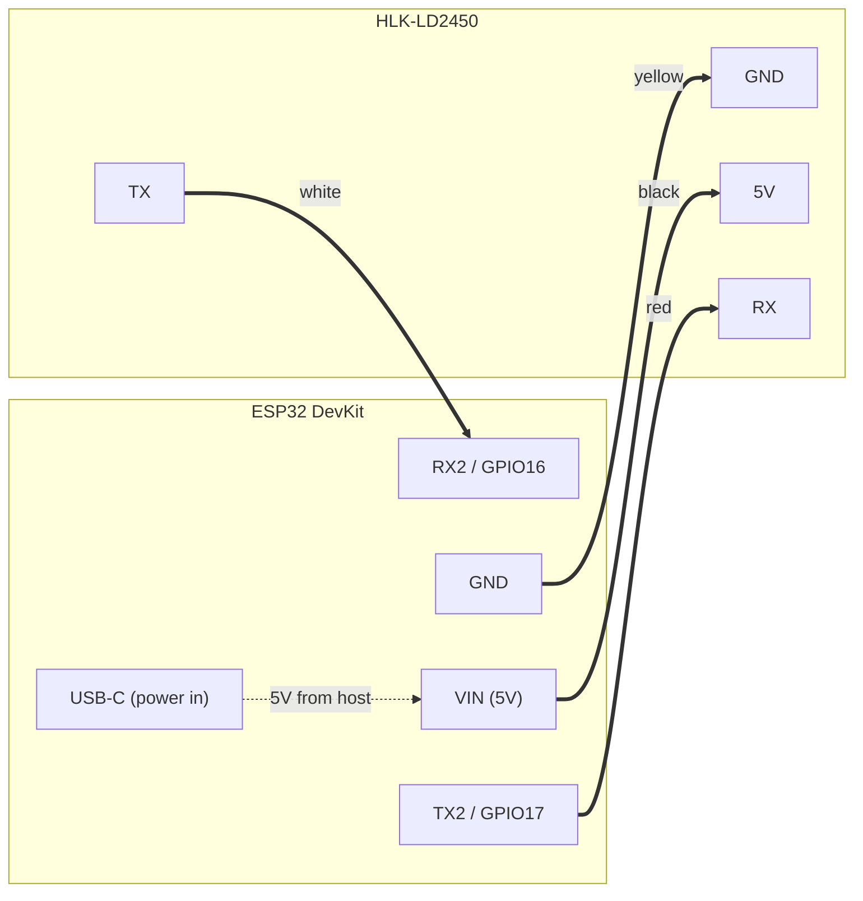

# Hardware

## Components
- **ESP32 DevKit** — CP2102 USB-to-UART bridge, 3.3V logic
- **HLK-LD2450** — 24GHz mmWave radar, ±60° azimuth, 6m range, tracks up to 3 targets simultaneously
- **Raspberry Pi** + 27" touch display — HA dashboard on end wall; powers ESP32 + LD2450 via monitor USB downstream port
- **27" touch monitor** — always-on USB-A port provides power to ESP32 + LD2450 (~200mA, well within 900mA USB 3.0 spec)

LD2450 IO level is 3.3V — matches ESP32 directly, no level shifter needed.

## Wiring

| LD2450 | Wire color | ESP32 |
|---|---|---|
| 5V | Black | VIN |
| GND | Yellow | GND |
| TX | White | RX2 (GPIO16) |
| RX | Red | TX2 (GPIO17) |

## Mounting
Mount the LD2450 on the **end wall opposite the front door**, ~1.5m high, pointing down the hallway length. This gives a clean axis along the full detection zone — better than ceiling mount for a narrow hallway.

**Important:** after mounting, zones must be reconfigured in HLKRadarTool. With end-wall mounting the Y axis runs the hallway length (toward the front door), and the X axis covers the hallway width.
