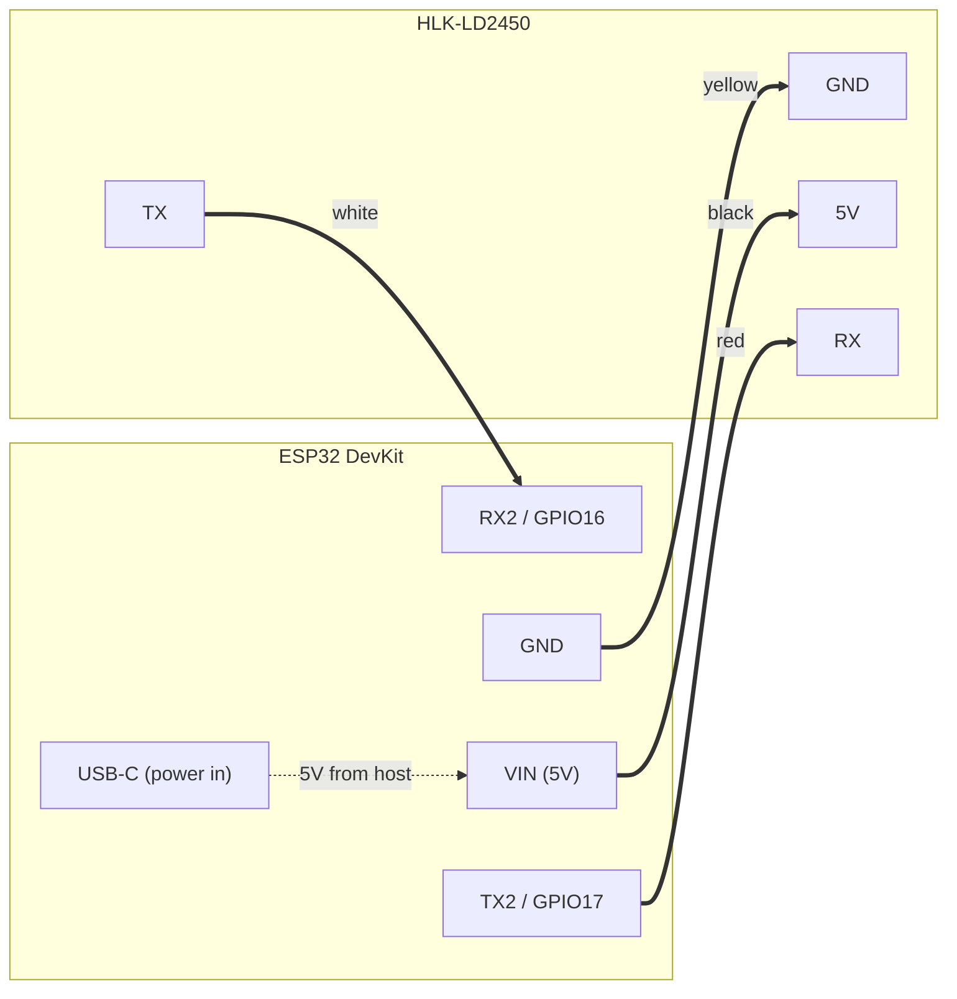

created: 22.04.2026, 01:26
status: hardware installed, streaming to HA

## Idea
Detect presence in the hallway and switch either the ceiling (bright) light during the day or a soft glow light at night.

## Why
Hands-free lighting that adapts to time-of-day — bright when navigating the hallway during the day, soft glow at night so it doesn't blast your eyes.

## Constraints
- LD2450 has no wake-on-motion pin and draws ~80mA continuously → battery power is not practical. Must be mains-powered (USB-C).
- LD2450 IO level is 3.3V — matches ESP32 dev board directly, no level shifter.

## Hardware
- **ESP32 DevKit** (CP2102 USB-to-UART, 3.3V logic)
- **HLK-LD2450** 24GHz mmWave radar (±60° azimuth, 6m range, tracks up to 3 targets)

### Wiring
| LD2450 | ESP32 |
|---|---|
| 5V | VIN |
| GND | GND |
| TX | RX2 (GPIO16) |
| RX | TX2 (GPIO17) |



Mount vertically ~1.5m up, facing down the hallway.

## Software stack
- ESPHome 2026.4.1 with built-in `ld2450` component
- Home Assistant via native API integration
- Zones configured via **HLKRadarTool** Android app (Bluetooth) — stored in module flash, persist across reboots

## Working ESPHome config
```yaml
esphome:
  name: hallway-presence
  friendly_name: Hallway Presence

esp32:
  board: esp32dev
  framework:
    type: esp-idf

logger:

api:
  encryption:
    key: "<stored in secrets>"

ota:
  - platform: esphome
    password: "<stored in secrets>"

wifi:
  ssid: !secret wifi_ssid
  password: !secret wifi_password
  ap:
    ssid: "Hallway Fallback Hotspot"
    password: "<fallback>"

captive_portal:

uart:
  id: ld2450_uart
  tx_pin: GPIO17
  rx_pin: GPIO16
  baud_rate: 256000
  parity: NONE
  stop_bits: 1

ld2450:
  uart_id: ld2450_uart
  id: ld2450_radar

binary_sensor:
  - platform: ld2450
    ld2450_id: ld2450_radar
    has_target:
      name: Presence
    has_moving_target:
      name: Moving
    has_still_target:
      name: Still

sensor:
  - platform: ld2450
    ld2450_id: ld2450_radar
    target_1:
      x: { name: T1 X }
      y: { name: T1 Y }
      speed: { name: T1 Speed }
      resolution: { name: T1 Resolution }
```

## Zone configuration
Zones were defined via HLKRadarTool (Android, Bluetooth). 2 zones set covering the hallway, excluding adjacent doorways. Zones persist in LD2450 flash — ESPHome does not push zone coordinates from YAML, so the app-defined zones remain authoritative.

## Lessons learned
- "Configuration does not match the platform of the connected device. Expected an UNKNOWN device." → first flash required manually forcing bootloader mode (hold BOOT, press EN, release BOOT, then install).
- ESPHome YAML gotchas on 2026.4.1: `throttle` was removed from the `ld2450` component; use per-sensor filters. `distance_resolution` was renamed to `resolution`.
- Avoid trial firmware versions of LD2450 (names containing "trial") — they expire and the app forces an upgrade page that requires a Hi-Link authorization code.
- HLKRadarTool app: leave UART baud at 256000 to match ESPHome.

## Reference links
- [ESPHome LD2450 component](https://esphome.io/components/sensor/ld2450/)
- [LD2450 Serial Protocol PDF](https://make.net.za/wp-content/datasheets/HLK%20LD2450%20Serial%20Communication%20Protocol%20v1.03.pdf)
- [LD2450 Instruction Manual PDF](https://www.tinytronics.nl/product_files/006000_HLK-LD2450-Instruction-Manual.pdf)
- [Hi-Link Download Center](https://hlktech.net/index.php?id=download-center)
- [TillFleisch ESPHome-HLK-LD2450 (alternative component with convex polygon zones)](https://github.com/TillFleisch/ESPHome-HLK-LD2450)

## Next step
- Build HA automation: if hallway presence + sun below horizon → soft glow light; else → ceiling light. Add timeout-off helper (e.g., 2 min after last presence).
- Tune zones if false triggers occur from adjacent rooms.
- Physical mount / enclosure for the ESP32 + LD2450 combo.
